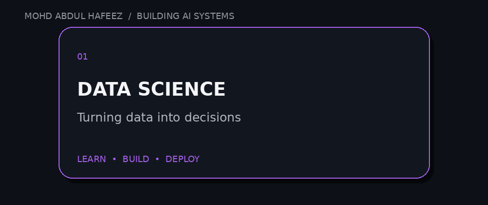

 

  

&nbsp;

&nbsp;

  

 

---

# `01` — ENGINEERING IDENTITY

### DATA → MODELS → SYSTEMS → PRODUCTS

<table>
<tr>
<td width="50%" valign="top">

### WHO I AM

**Mohd Abdul Hafeez**

B.Tech Computer Science Engineering · 2027

I work at the intersection of **Data Science, Machine Learning and Generative AI**.

My goal isn't to stop at training a model.

I want to understand the mathematics, build the system, expose it through an API, deploy it, and make it useful.

</td>

<td width="50%" valign="top">

### WHAT I'M BUILDING

**SCANIX AI**

A food intelligence platform focused on:

- Ingredient intelligence
- FSSAI compliance
- NLP pipelines
- LLM-powered reasoning
- Regulatory scoring

Alongside it, I'm going deeper into:

- Transformers
- RAG architectures
- AI agents
- FastAPI
- Production ML
- DSA

</td>
</tr>
</table>

 

> **I don't want models that only work in notebooks.**
>
> **I want systems that work in the real world.**

 

---

# `02` — THE AI STACK

<table align="center">
<tr>

<td align="center" width="33%">

### LANGUAGES

  

</td>

<td align="center" width="33%">

### ML / GENAI

  

  

</td>

<td align="center" width="33%">

### ENGINEERING

  

</td>

</tr>
</table>

 

### DATA & ANALYTICS

 

---

# `03` — HOW I THINK

 

<table>
<tr>

<td align="center" width="25%">

### 01

**UNDERSTAND**

Mathematics  
Data  
Algorithms

</td>

<td align="center" width="25%">

### 02

**MODEL**

Experiment  
Validate  
Optimize

</td>

<td align="center" width="25%">

### 03

**ENGINEER**

APIs  
Pipelines  
Infrastructure

</td>

<td align="center" width="25%">

### 04

**SHIP**

Deploy  
Measure  
Iterate

</td>

</tr>
</table>

 

`RESEARCH → BUILD → DEPLOY → MEASURE → IMPROVE`

 

---

# `04` — GITHUB PULSE

 

&nbsp;&nbsp;&nbsp;

  

 

---

# `05` — CONTRIBUTION MATRIX

 

 

---

# `06` — THE SNAKE

 

 

---

# `07` — 3D ACTIVITY

 

 

---

# `08` — PRINCIPLE

 

### **DISCIPLINE OVER MOTIVATION.**
### **DEPTH OVER HYPE.**
### **SYSTEMS OVER NOTEBOOKS.**

 

`BUILD → DEPLOY → LEARN → REPEAT`

 

---

# `09` — LET'S BUILD

 

&nbsp;

  

**Open to collaborations, internships & ambitious AI/ML projects.**

  

